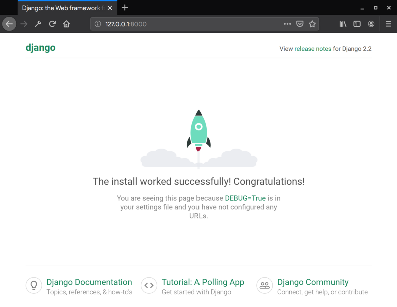
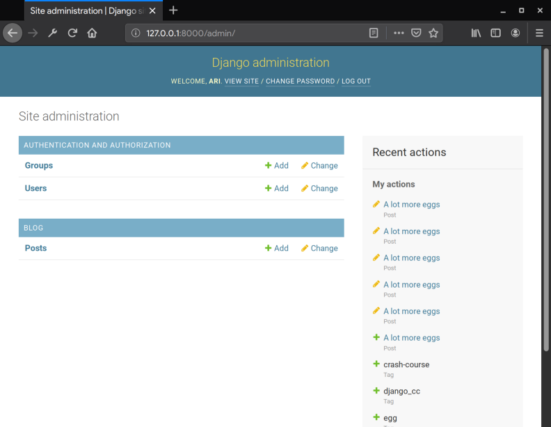
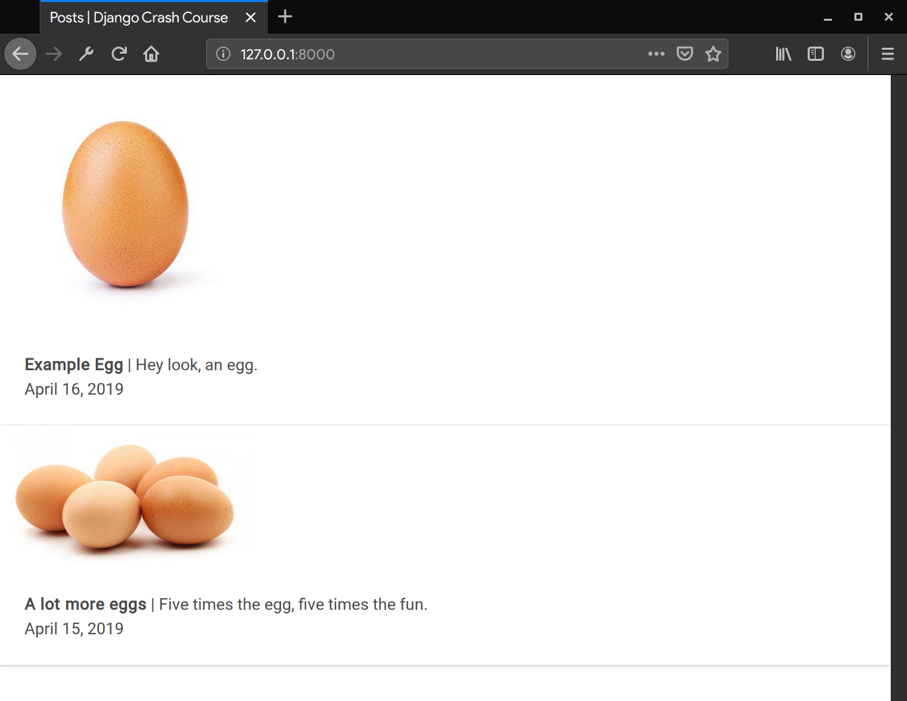

## Introduction

**This is not a tutorial.** This crash course is a quick way to get started making a basic Django website **without** going in-depth about the underlying concepts that are required to make complex web applications. For every step of this crash course I will link a more thorough explanation of the tools and concept you're using so you can get a better understanding of Django while creating your first project.

### Prerequisites

[Basic Python](https://www.learnpython.org/en/Hello%2C_World%21), [HTML](https://www.w3schools.com/html/), [CSS](https://www.w3schools.com/css/) and [Unix Command Line](https://www.learnenough.com/command-line-tutorial/basics).
As long as you're comfortable with all that, you're good.

### Our Goal

We're making a website where you can **upload an image with a title, date and description**. Simple.

### So, what is Django?

**Django** _/JANG-oh/_ — A type of tool ([web framework](https://en.wikipedia.org/wiki/Web_framework)) most known for helping people make neat websites quickly with few mistakes.

Making stuff in Django follows this pattern:

1. **Model** — _How you store stuff._ This is where we will tell Django how to store our images, titles, dates and descriptions.
2. **View** — _Where your project thinks._ This is how our website will get the stuff we stored based on our **models** and process it for the user.
3. **Template** — _How your project presents the stuff it was thinking about._ The **view** will use this to display the contents it processed based on our **models**.

Django does more complex (and really fun) things, but if you're starting out that's all you need to know _for now_. [\[in-depth\]](https://developer.mozilla.org/en-US/docs/Learn/Server-side/Django/Introduction#What_is_Django)

---

## Setting up our project

**Notice for Windows users:** By default, Windows doesn't have a Unix command line, which is a prerequisite for this crash course. The October 2018 update for Windows 10 offers Linux subsystems, such as Ubuntu. Please install and set up a Linux subsystem to utilize the Unix command line.

We're going to use your computer's terminal to set up our python environment and Django. Let's make the project in our computer's `Documents` folder, so enter these commands:

```bash
cd ~/Documents
python3 -m venv django_cc
```

`python3 -m venv django_cc` will create a virtual environment within a folder called `django_cc` for our project so all the stuff we install for it to work won't interfere with anything else on your system. [\[in-depth\]](https://virtualenv.pypa.io/en/stable/)

Next we'll get in our project folder, enable our new python environment and install Django.

```bash
cd django_cc
source bin/activate
pip install django
```

`source bin/activate` will activate the virtual environment we created. This means when we install Django, it won't be installed on the whole system, just in our project. `pip install django` will use Python's package manager to install the most recent version of Django.

Now that Django is installed we get some new commands. Let's start by creating a project within Django, migrating our development database and finally starting our local development server for the first time to ensure we did everything right.

```bash
django-admin startproject django_cc
cd django_cc
python3 manage.py migrate
python3 manage.py runserver
```

`django-admin start project django_cc` is telling Django to make the stem of our project where everything else will be connected (i.e. Django apps). This is also where we will find `manage.py` the file that we will use to interact with Django. [\[in-depth\]](https://docs.djangoproject.com/en/2.2/ref/django-admin/)

`python3 manage.py migrate` is used to let Django know that changes have been made to our models. Since we've just started our project this will be our initial migration which establishes models Django makes on its own (i.e. accounts, activity logs, permissions, etc.). [\[in-depth\]](https://docs.djangoproject.com/en/2.2/topics/migrations/)

`python3 manage.py runserver` will start our development server where we will be testing our project.

To see the development server in action go to [127.0.0.1:8000](http://127.0.0.1:8000/) in your browser. A Django start up page should appear:



### The Database

Next grab your favorite text editor or python IDE because we're going to delve into Django. We're going to start by creating a Django app where we will write all of our models for this project.

```bash
python manage.py startapp blog
```

In order for our core project to recognize this app we need to let it know our `blog` app exists by adding it to `INSTALLED_APPS` in `django_cc/settings.py` like so:

```python
# Application definition

INSTALLED_APPS = [
    'django.contrib.admin',
    'django.contrib.auth',
    'django.contrib.contenttypes',
    'django.contrib.sessions',
    'django.contrib.messages',
    'django.contrib.staticfiles',
    'blog',
]
```

### Media file support

Let's add the following to the bottom of `settings.py` so Django knows where to store media files such as the images that we upload:

```python
# Media file support

MEDIA_ROOT = os.path.join(BASE_DIR, 'media')
MEDIA_URL = '/media/'
```

We'll need to do the same for our templates folder by updating `DIRS` to handle `[os.path.join(BASE_DIR, 'templates')]` instead of the default `[]`:

```python
TEMPLATES = [
    {
        'BACKEND': 'django.template.backends.django.DjangoTemplates',
        'DIRS': [os.path.join(BASE_DIR, 'templates')],
        'APP_DIRS': True,
        'OPTIONS': {
            'context_processors': [
                'django.template.context_processors.debug',
                'django.template.context_processors.request',
                'django.contrib.auth.context_processors.auth',
                'django.contrib.messages.context_processors.messages',
            ],
        },
    },
]
```

We will also need to add a few imports and a conditional at the bottom of `django_cc/urls.py` so the files are accessible on the development server:

```python
from django.conf.urls import url
from django.contrib import admin

# Add these imports for static file support and to get
# directory details from Django's settings.py
from django.conf.urls.static import static
from django.conf import settings

urlpatterns = [
    url(r'^admin/', admin.site.urls),
]

# Add this to enable media file support on the development server
if settings.DEBUG:
    urlpatterns += static(settings.MEDIA_URL, document_root=settings.MEDIA_ROOT)
```

[\[in-depth\]](https://docs.djangoproject.com/en/2.2/howto/static-files/)

Great, our project is now set up, and we can begin by writing our models.

---

## Writing our models

Inside our new `blog` app we will find a `models.py` file where we will write our models for our database. The class `Post` will act as our first model for uploading a post with an image, title, description, and date published.

```python
from django.db import models
import datetime

class Post(models.Model):
    image = models.FileField(upload_to='images/')
    title = models.CharField(default="", max_length=64)
    description = models.CharField(default="", max_length=512)
    date = models.DateField(default=datetime.date.today)
```

`models.FileField(upload_to='images/')` acts as a field where we will upload images to an image folder in the media directory we configured in settings.

`models.CharField(default="", max_length=n)` is a basic text field where the max character length is **n**.

`models.DateField(default=datetime.date.today)` is self-explanatory, it's a date/time field that is set to the current date and time.

[\[in-depth\]](https://docs.djangoproject.com/en/2.2/topics/db/examples/many_to_many/)

To finish off our models let's tell Django to order them based newest to oldest:

```python
class Post(models.Model):
    image = models.FileField(upload_to='images/')
    title = models.CharField(default="", max_length=64)
    description = models.CharField(default="", max_length=512)
    date = models.DateField(default=datetime.date.today)
    class Meta:
        ordering = ['-date']
    def __str__(self):
        return self.title
```

The `Meta` class can do a lot, in our case we will use it to order our models based on time. The `__str__` function is telling Django to display the title (instead of saying Post 1, Post 2, etc.) for when we interact with our entries later in the Django admin panel. [\[in-depth\]](https://docs.djangoproject.com/en/2.2/ref/models/options/#ordering)

### Migrating our new models

Finish off our models with the following two commands that essentially tell Django that we've made some changes and that they should be applied to our database:

```bash
python3 manage.py makemigrations
python3 manage.py migrate
```

Congratulations! Our database is all set up for our posts. There is one issue, though. We can't edit them right now. Let's get you set up with the Django admin panel so you make some posts.

### Admin control panel

Inside our `blog` app go to `admin.py` and add the following:

```python
from django.contrib import admin
from blog.models import Post

admin.site.register(Post)
```

`from blog.models import Post` imports all the models that we've just created. `admin.site.register(<model_name>)` tells Django to display that model within the control panel.

Next we will create a superuser, so we can log into the admin panel. Type the following command and follow the prompts. You only need to fill out the username and passwords prompts.

```bash
$ python3 manage.py createsuperuser
Username (leave blank to use 'ari'):
Email address:
Password:
Password (again):
Superuser created successfully.
```

Once completed head over to [`127.0.0.1:8000/admin`](http://127.0.0.1:8000/admin) and sign in with the credentials you just wrote. You should see this page:



From here you can add posts to your Django project. We are officially done with our models. Next will design our view so Django can serve our posts.

---

## View logic

A view is how Django knows what to do when we ask for a page. The first thing we have to do is create a `views.py` file in `django_cc`. In that file paste the following:

```python
from django.shortcuts import render
from django.views.generic.base import View
from django.views.generic import TemplateView
from blog.models import Post

class PostFeed(TemplateView):
    template_name = 'index.html'

    def get_context_data(self, *args, **kwargs):
        context = dict()
        context["posts"] = Post.objects.all()
        return context
```

`from django.views.generic import TemplateView` allows us to use Django's basic template view which is all that we need for displaying our posts. `from blog.models import Post` imports all of our database models for our view functions to use.

`PostFeed` is our basic template view that will use an `index.html` file we will create next to render our database contents.

`get_context_data` is how we will send our template the information from the database. `context["posts"] = Post.objects.all()` Our template will refer to `posts` within our `context` dictionary for a list of all posts that is collected from the database using `Post.objects.all()`

[\[in-depth\]](https://docs.djangoproject.com/en/2.2/ref/class-based-views/base/)

In `urls.py` we will need to add a new path so Django knows when that URL is requested to call our view:

```python
from django.conf.urls import url
from django.contrib import admin
from django.conf.urls.static import static
from django.conf import settings

# import path for easy urls
from django.urls import path

# import our views so urls.py can call them
from django_cc.views import PostFeed

urlpatterns = [

    # Path for root of our website that will display the post feed
    path('', PostFeed.as_view(template_name="index.html"), name="PostFeed"),
    url(r'^admin/', admin.site.urls),
]

if settings.DEBUG:
    urlpatterns += static(settings.MEDIA_URL, document_root=settings.MEDIA_ROOT)
```

Our basic view logic is now complete, now we need to build our index template for displaying our posts.

---

## Templates with Style

In the root of our Django project where you can find our `database` and `django_cc` folders create a `templates` folder and make an `index.html` file inside. For the design of our site we're going to use the framework [Bulma](https://bulma.io/documentation/) so we won't need to write any CSS. Here is a boilerplate we can use for our template.

```html
<!DOCTYPE html>
<html lang="en">
  <head>
    <title>Posts | Django Crash Course</title>
    <link
      rel="stylesheet"
      href="https://cdnjs.cloudflare.com/ajax/libs/bulma/0.7.4/css/bulma.min.css"
      integrity="sha256-8B1OaG0zT7uYA572S2xOxWACq9NXYPQ+U5kHPV1bJN4="
      crossorigin="anonymous"
    />
  </head>
  <body></body>
</html>
```

Django templates utilize a DRY version of HTML called Django HTML. This is how we will send our context to render in our `index.html` template. In the body of the boilerplate let's add a basic card with the context for our posts.

```html
<div class="container">
  
  <div class="card">
    <div class="card-image">
      <figure class="image">
        
      </figure>
    </div>
    <div class="card-content">
      <div class="content">
        <b>{{ post.title }}</b> | {{ post.description }}
        <br />
        <time datetime="{{ post.date }}">{{ post.date }}</time>
      </div>
    </div>
  </div>
  
</div>
```

`` acts as a for loop that will duplicate its contents for each post inside `posts`.

Every time the for loop runs the context for the post in the current iteration is placed in the HTML when it is referred to using `{{ <variable> }}`

`{{ post.image.url }}` is how you refer to the image's URL, you cannot just reference the image itself.

When we visit [127.0.0.1:8000](http://127.0.0.1:8000) there should be a list of all the posts we've added in the control panel:



Now we have a website that displays what we add to our control panel in Bulma cards. Neat.

[\[in-depth\]](https://docs.djangoproject.com/en/2.2/topics/templates/)

---

## Wrap Up

Django is a wonderful framework for building websites and other complex things. Today you've created a very basic website that is capable of displaying posts akin to Instagram and in the future hopefully you can build Instagram yourself. For now, I suggest learning more about Django either through [their documentation](https://docs.djangoproject.com/en/2.2/) or [this introduction (which got me started)](https://rnvarma.gitbooks.io/intro-to-django-real/content/).

**FYI** — Follow [this tutorial by Digital Ocean](https://www.digitalocean.com/community/tutorials/how-to-set-up-django-with-postgres-nginx-and-gunicorn-on-ubuntu-18-04) so you can learn how to host your Django creations for the world to see. If you want to host with Digital Ocean, [use my referral link for a discount](https://m.do.co/c/b95c2a8a5568).

Article cover photo by [Fabian Grohs](https://unsplash.com/@grohsfabian?utm_source=unsplash&utm_medium=referral&utm_content=creditCopyText) on [Unsplash](https://unsplash.com/@ceiphr/likes?utm_source=unsplash&utm_medium=referral&utm_content=creditCopyText).

_Edit: Renamed classes to adhere to PEP 8 and renamed database app to blog._

_Edit: Fixed `return context`, `settings.py` template directory issue and references to blog models._ Thank you, Chris Merck for the feedback.
