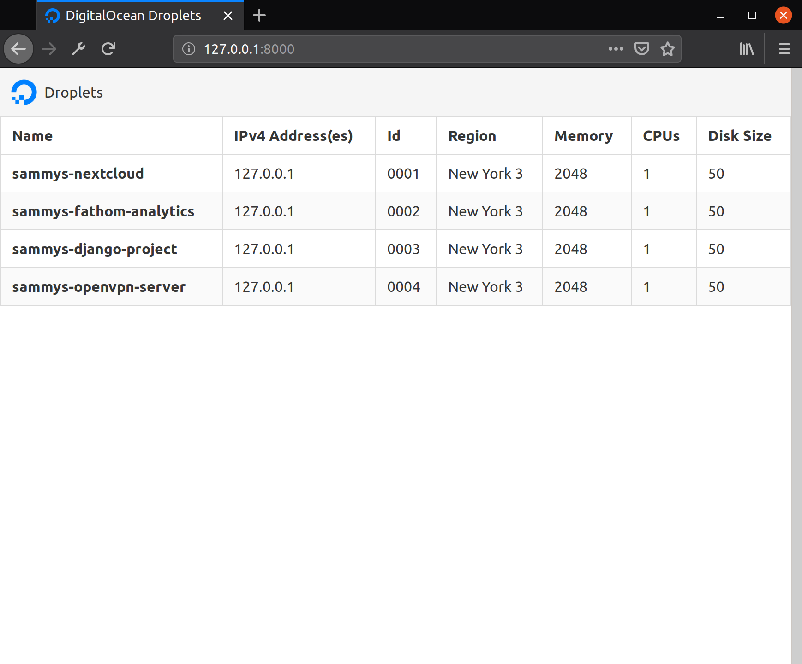

## Introduction

In this tutorial you will build a Django project that will display your DigitalOcean account's Droplet information using the [DigitalOcean v2 API](https://developers.digitalocean.com/documentation/v2/). Once you complete this tutorial, you should have a Django project that can produce a web page that looks like this:

<a href="https://www.digitalocean.com/community/tutorials/how-to-display-data-from-the-digitalocean-api-with-django">
<button class="button article-cta has-white-text is-primary">Read Tutorial</button>
</a>

This tutorial was created as a part of DigitalOcean's [Write for DOnations program](https://www.digitalocean.com/write-for-donations/). Article cover photo from DigitalOcean.
